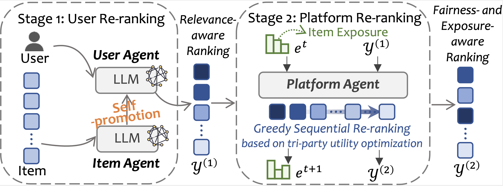

# TriRec

**Tri-party LLM-agent Recommendation Framework** (TriRec) that explicitly coordinates user utility, item exposure, and platform-level fairness.

## Framework



## Overview

TriRec is a two-stage pipeline built on LLM agents:

- **Stage 1: Generative item self-promotion.** Item agents are no longer
  passive candidates. Given a target user's interest preference, each item
  agent generates a personalized promotion (e.g., the same CD player may
  emphasize *"high audio fidelity"* to musicians, *"popular tracks"* to
  students, or *"easy audio playback"* to seniors). This improves matching
  quality and provides long-tail items with opportunities to gain exposure.
- **Stage 2: Platform-led multi-objective re-ranking.** A platform agent
  performs *sequential* re-ranking over the Stage-1 candidate list. For each
  position, it jointly considers (i) immediate user relevance,
  (ii) platform-level fairness, and (iii) expected item utility, balancing
  tri-party interests across the ranked list.

**Candidate construction.** We follow a leave-one-out protocol. For each test
instance, the candidate set contains 1 ground-truth item and `n` hard
negatives retrieved by a **pre-trained SASRec** retriever, yielding a realistic and challenging evaluation setting. Default
`n = 9` (|C_u| = 10), consistent with established agent-based recommendation
studies.

## Repository Layout

```
TriRec/
├── src/                                Core code
│   ├── config.py                       PROJECT_ROOT / DATASET_ROOT / DOMAIN
│   ├── request.py                      LLM client 
│   ├── prompt.py                       Prompt templates
│   ├── AgentCF.py                      User/item agent memory training
│   ├── TriRec_stage1_recall.py         Stage 1: item self-promotion + LLM ranking
│   ├── TriRec_stage2_rerank.py         Stage 2: platform sequential re-ranking
│   └── SASRec/
│       └── train.py                    Pre-train SASRec (upstream retriever for hard negatives)
├── dataprocess/                        Data preprocessing scripts
├── evaluate/                           Evaluation (accuracy / MGU / DGU / EIU)
├── scripts/                            End-to-end runnable bash entries
└── requirements.txt
```

Directories created on demand at runtime: `dataset/`, `memory/`, `log/`,
`exposure/`, `analyze/`, `log_visual/`, `baselines/`.

## Environment

```bash
conda create -n trirec python=3.10 -y
conda activate trirec
pip install -r requirements.txt

export OPENAI_API_KEY=sk-xxxx              # required
export MAX_WORKERS=16                      # optional, LLM concurrency
export SBERT_MODEL_PATH=                   # optional, local Sentence-BERT path
```

## End-to-End Pipeline

Place raw Amazon Reviews `*.jsonl.gz` (meta + inter) under
`dataset/org_data/meta/` and `dataset/org_data/inter/`. Default
`DOMAIN = "CDs"` (configurable in `src/config.py`).

```bash
# 1. Data preprocessing: trans -> filter_meta -> filter_inter -> DataPrepare
bash scripts/00_prepare_data.sh

# 2. Semantic embeddings / exposure statistics
bash scripts/01_embeddings.sh

# 3. Agent memory training + SASRec pre-training (upstream retriever)
bash scripts/02_train_agentcf.sh           # user/item agent memory
bash scripts/03_train_sasrec.sh            # SASRec checkpoint for hard-negative sampling

# 4. Stage 1: item self-promotion + LLM ranking over hard-negative candidate set
export EXPERIMENT_ID=run01
bash scripts/04_stage1_recall.sh
#  -> log/exp_run01/recommendation_process.jsonl

# 5. Stage 2: platform sequential re-ranking
bash scripts/05_stage2_rerank.sh log/exp_run01/recommendation_process.jsonl \
     --lambda1 0.5 --lambda2 0.5 --lambda_ru 10 --alpha_p 0.1
#  -> log_visual/exp_run01/<tag>/

# 6. Evaluation (accuracy + group fairness + item utility)
bash scripts/06_evaluate.sh \
     log/exp_run01/recommendation_process.jsonl \
     log_visual/exp_run01/manual_default
#  -> analyze/*.txt
```

## Configuration

Edit `src/config.py`:

| Field | Default | Description |
| --- | --- | --- |
| `DOMAIN` | `"CDs"` | Single-domain dataset (`CDs` / `goodreads_books_young_adult` / `steam_games` / `Movies_and_TV`) |
| `num_users_to_sample` | `2000` | Number of sampled users |
| `candidate_num` | `10` | Stage-1 candidate set size `|C_u|` (ground-truth + hard negatives) |
| `model` | `"gpt-4o-mini"` | LLM backbone |

Runtime environment variables: `OPENAI_API_KEY`,
`MAX_WORKERS`, `CAND_NUM`, `EXPERIMENT_ID`, `CUDA_VISIBLE_DEVICES`,
`SBERT_MODEL_PATH`.

## License

For academic research only.
