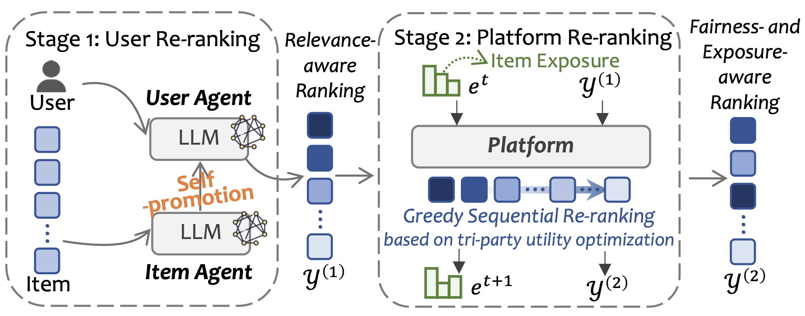
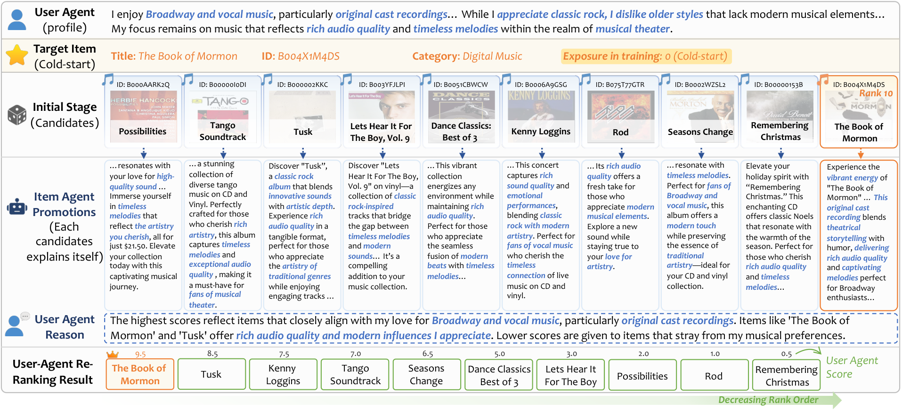

# TriRec

**Tri-party LLM-agent Recommendation Framework** (TriRec) that explicitly coordinates user utility, item exposure, and platform-level fairness.

## Framework



## Overview

TriRec is a two-stage pipeline:

- **Stage 1: Generative item self-promotion.** Item agents are no longer
  passive candidates. Given a target user's interest preference, each item
  agent generates a personalized promotion (e.g., the same CD player may
  emphasize *"high audio fidelity"* to musicians, *"popular tracks"* to
  students, or *"easy audio playback"* to seniors). This improves matching
  quality and provides long-tail items with opportunities to gain exposure.
- **Stage 2: Platform-led multi-objective re-ranking.** The platform
  performs *sequential* re-ranking over the Stage-1 candidate list. For each
  position, it jointly considers (i) immediate user relevance,
  (ii) platform-level fairness, and (iii) expected item utility, balancing
  tri-party interests across the ranked list.

**Candidate construction.** We follow a leave-one-out protocol. For each test
instance, the candidate set contains 1 ground-truth item and `n` hard
negatives retrieved by a **pre-trained SASRec** retriever, yielding a realistic and challenging evaluation setting. Default
`n = 9` (|C_u| = 10), consistent with established agent-based recommendation
studies.

## Case Study



A worked example of the Stage-1 pipeline on a **cold-start** item
(`B004X1M4DS`, *The Book of Mormon*) that had **zero exposure** in the training
set and therefore entered the candidate list at rank 10.

1. **User agent profile.** The user prefers Broadway and vocal music,
   particularly original cast recordings, and dislikes older styles.
2. **Item agent promotions.** Each of the 10 candidates writes its own ad copy
   conditioned on that profile. The cold-start item highlights the attributes
   that actually match the user (original cast recording, theatrical
   storytelling), rather than relying on historical popularity.
3. **User agent scoring.** The user agent scores all candidates on a 0-10 scale
   and gives a rationale, ranking the target item first (9.5).

Because the ranking is driven by semantic alignment instead of interaction
history, an item with no exposure can still reach the top position — this is the
mechanism by which self-promotion opens up exposure opportunities for long-tail
and cold-start items.

## Repository Layout

```
TriRec/
├── src/                                Core code
│   ├── config.py                       PROJECT_ROOT / DATASET_ROOT / DOMAIN
│   ├── request.py                      LLM client 
│   ├── prompt.py                       Prompt templates
│   ├── AgentCF.py                      User/item agent memory training
│   ├── TriRec_stage1_recall.py         Stage 1: item self-promotion + LLM ranking
│   ├── TriRec_stage2_rerank.py         Stage 2: platform sequential re-ranking
│   └── SASRec/
│       └── train.py                    Pre-train SASRec (upstream retriever for hard negatives)
├── dataprocess/                        Data preprocessing scripts
├── evaluate/                           Evaluation (accuracy / MGU / DGU / EIU)
├── scripts/                            End-to-end runnable bash entries
└── requirements.txt
```

Directories created on demand at runtime: `dataset/`, `memory/`, `log/`,
`exposure/`, `analyze/`, `log_visual/`.

## Environment

```bash
conda create -n trirec python=3.10 -y
conda activate trirec
pip install -r requirements.txt

export OPENAI_API_KEY=sk-xxxx              # required
export MAX_WORKERS=16                      # optional, LLM concurrency
export SBERT_MODEL_PATH=                   # optional, local Sentence-BERT path
```

## End-to-End Pipeline

Place raw Amazon Reviews `*.jsonl.gz` (meta + inter) under
`dataset/org_data/meta/` and `dataset/org_data/inter/`. Default
`DOMAIN = "CDs"` (configurable in `src/config.py`).

```bash
# 1. Data preprocessing: trans -> filter_meta -> filter_inter -> DataPrepare
bash scripts/00_prepare_data.sh

# 2. Semantic embeddings / exposure statistics
bash scripts/01_embeddings.sh

# 3. Agent memory training + SASRec pre-training (upstream retriever)
bash scripts/02_train_agentcf.sh           # user/item agent memory
bash scripts/03_train_sasrec.sh            # SASRec checkpoint for hard-negative sampling

# 4. Stage 1: item self-promotion + LLM ranking over hard-negative candidate set
export EXPERIMENT_ID=run01
bash scripts/04_stage1_recall.sh
#  -> log/exp_run01/recommendation_process.jsonl

# 5. Stage 2: platform sequential re-ranking
bash scripts/05_stage2_rerank.sh log/exp_run01/recommendation_process.jsonl \
     --lambda1 0.5 --lambda2 0.5 --lambda_item 10 --alpha_p 0.1
#  -> log_visual/exp_run01/exp_run01_recommendation_process_alpha<a>.jsonl

# 6. Evaluation (accuracy + group fairness + item utility)
bash scripts/06_evaluate.sh \
     log/exp_run01/recommendation_process.jsonl \
     log_visual/exp_run01
#  -> analyze/*.txt
```

## Configuration

Edit `src/config.py`:

| Field | Default | Description |
| --- | --- | --- |
| `DOMAIN` | `"CDs"` | Single-domain dataset (`CDs` / `goodreads_books_young_adult` / `steam_games` / `Movies_and_TV`) |
| `num_users_to_sample` | `2000` | Number of sampled users |
| `candidate_num` | `10` | Stage-1 candidate set size `|C_u|` (ground-truth + hard negatives) |
| `model` | `"gpt-4o-mini"` | LLM backbone |
| `PROMO_MODE` | `"full"` | Promotion mode, see below |
| `MEMORY_UPDATE_BUFFER` | `3` | Promotions buffered per item before one integration |

### Promotion modes (`PROMO_MODE`)

The four arms differ **only** in the item-side input handed to the user agent;
the candidate sets are unchanged.

| Mode | Item-side input | User-side input |
| --- | --- | --- |
| `none` | raw metadata, no LLM call | real user profile |
| `generic` | LLM rewrite of that metadata, blind to the target user | constant placeholder |
| `full` | user-conditioned self-promotion (main method) | real user profile |
| `grounded` | promotion restricted to catalogue-verifiable attributes | real user profile |

`generic` versus `none` isolates **expression** (whether a written promotion is
supplied at all); `full` versus `generic` isolates **conditioning** (whether that
promotion is targeted at the arriving user), holding the LLM rewrite fixed.
`grounded` is a fourth arm that swaps the information source rather than
deleting adjectives: it keeps personalization intact and only restricts which
facts may be asserted.

```bash
# One Stage-1 run per arm; each writes its own log/exp_<EXPERIMENT_ID>/
for arm in none generic full grounded; do
    EXPERIMENT_ID=$arm PROMO_MODE=$arm bash scripts/04_stage1_recall.sh
done
```

### Item memory update (Eq. 4)

After serving a user, the item agent folds the promotion it just wrote back into
its own memory, so later promotions build on earlier phrasing instead of
restating metadata. Promotions are buffered per item and integrated by one LLM
call once `MEMORY_UPDATE_BUFFER` entries accumulate; the files under
`memory/<domain>_<n>/item/` are **modified in place**, so keep a pristine copy of
the memory directory if you intend to re-run from the same initial state.

The update consumes only the audience representation the promotion was
conditioned on and the generated text itself. The realized ranking and the
ground-truth interaction are never consumed, so no test signal enters memory.

Runtime environment variables: `OPENAI_API_KEY`,
`MAX_WORKERS`, `CAND_NUM`, `EXPERIMENT_ID`, `CUDA_VISIBLE_DEVICES`,
`SBERT_MODEL_PATH`, `PROMO_MODE`, `MEMORY_UPDATE_BUFFER`.

## Citation

If you find this work useful, please cite:

```bibtex
@article{trirec2026,
  title={Breaking User-Centric Agency: A Tri-Party Framework for Agent-Based Recommendation},
  author={Gong, Yaxin and Gao, Chongming and Fan, Chenxiao and Wang, Wenjie and Feng, Fuli and He, Xiangnan},
  journal={arXiv preprint arXiv:2603.10673},
  year={2026}
}
```

## License

For academic research only.
